# Propsoch - Landing Page Redesign

> A responsive redesign of the Propsoch landing page focused on clearer messaging, stronger visual hierarchy, improved interactions, accessibility, and performance.

## Live Demo

**Redesigned website:**  
https://propsoch-landing-page-redesign.vercel.app/

**GitHub:**  
https://github.com/vedant48/propsoch-landing-page-redesign

---

# Overview

The original Propsoch homepage contains a large amount of useful information, but several sections can be improved from a UX, visual hierarchy, responsive-design, accessibility, and performance perspective.

For this redesign, I first audited the existing production homepage using Lighthouse and reviewed the desktop and mobile experience. I then redesigned the hero and multiple existing sections while maintaining the core information architecture and purpose of the original page.

The redesign focuses on:

- Clearer value proposition
- Stronger visual hierarchy
- Consistent typography and spacing
- Better desktop/mobile behavior
- Reduced interaction friction
- More intentional video interaction
- Improved accessibility
- Responsive and optimized imagery
- Performance-conscious implementation

---

# Tech Stack

- **Next.js**
- **TypeScript**
- **Tailwind CSS**

---

# Part 1 - Analysis

## 1. Original Lighthouse Audit

A Lighthouse navigation audit was performed on the current Propsoch production homepage.

**Website:** https://www.propsoch.com/  
**Audit date:** 22 September 2026  
**Lighthouse version:** 13.4.1  
**Audit type:** Navigation

### Original Lighthouse Scores

| Category | Mobile | Desktop |
|---|---:|---:|
| **Performance** | **41 / 100** | **91 / 100** |
| **Accessibility** | **84 / 100** | **80 / 100** |
| **Best Practices** | **100 / 100** | **100 / 100** |
| **SEO** | **92 / 100** | **83 / 100** |

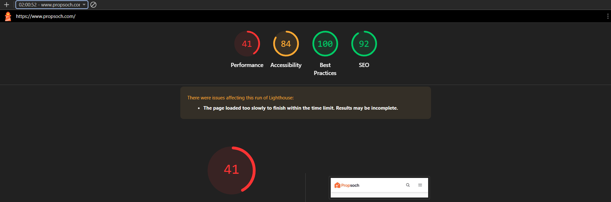

*Caption: Lighthouse audit of the original Propsoch production homepage on mobile.*

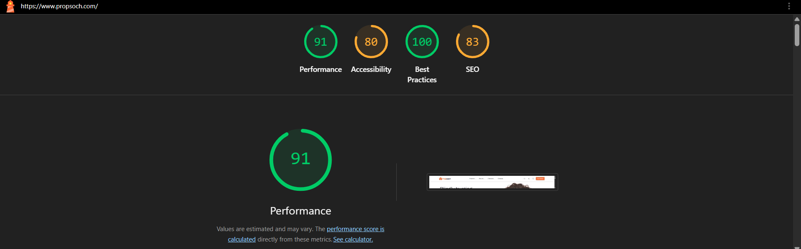

*Caption: Lighthouse audit of the original Propsoch production homepage on desktop.*

### Key Lighthouse observations

The most significant performance issue was **Largest Contentful Paint (LCP) at 5.9 seconds**, while First Contentful Paint was **1.6 seconds**.

Other notable findings:

- **Speed Index:** 5.3 s
- **Time to Interactive:** 16.0 s
- **JavaScript execution time:** 7.1 s
- **Main-thread work:** 11.9 s
- **Unused JavaScript:** approximately 370 KiB estimated savings
- **Render-blocking resources:** approximately 290 ms estimated savings
- **Legacy JavaScript:** approximately 60 KiB estimated savings

The accessibility audit also identified issues including insufficient color contrast, buttons without accessible names, invalid ARIA attribute values, and invalid list structure.

---

# 2. UX/UI Issues Identified

## Issue 1 - Hero: Unclear Value Proposition

### Problem

The original homepage opens with:

> “Blindly trusting a broker's Sales Pitch? Fake Claims? Sales Pitch? Fake Claims? Half Info?”

The messaging focuses heavily on the problems with traditional property buying before clearly explaining what Propsoch does. The primary CTA, **“Propsoch Kar”**, is also brand-specific and requires the user to understand what action it represents.

On desktop, the fragmented headline creates multiple competing ideas.

On mobile, the headline wraps into more lines, increasing the amount of information users need to process before reaching the CTA.

### Impact

The first viewport should quickly communicate:

1. What Propsoch offers
2. Why it is useful
3. What the user should do next

The original hero makes the user process the problem statement before getting to the solution.

### Solution

The redesign changes the hero to a direct value proposition:

> **“Make a smarter home-buying decision.”**

It is supported by:

- **“INDEPENDENT. UNBIASED. ON YOUR SIDE.”**
- Supporting service explanation
- Clear city selection
- **“Book a free call”** CTA
- Trust indicators such as **1000+ families guided**
- Supporting proof around independent advice and better buying decisions

This moves the communication from **problem-first** to **value-first**.

### Images

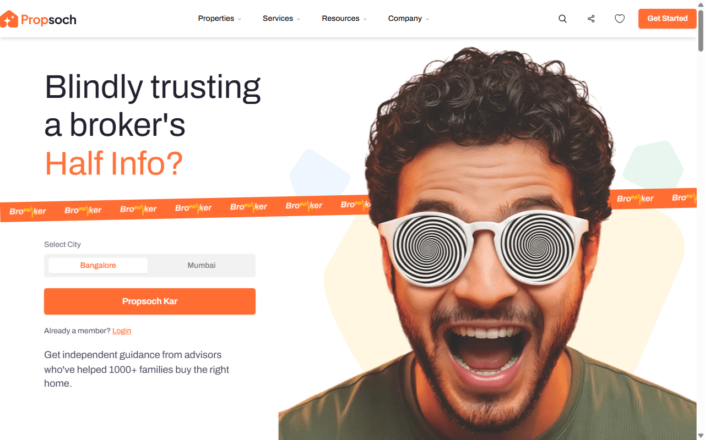

*Caption: Current Propsoch hero on desktop - problem-focused messaging and unclear primary action.*

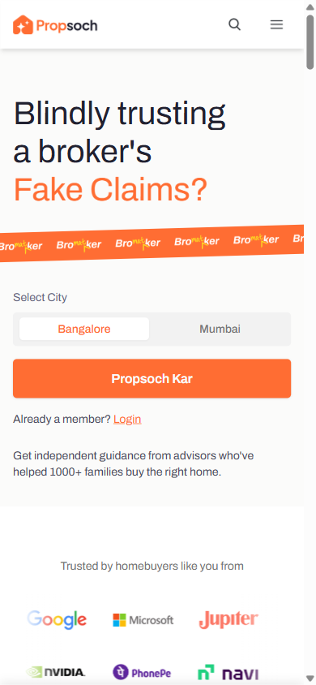

*Caption: Current Propsoch hero on mobile - headline wrapping increases the amount of information users must process.*


*Caption: Redesigned hero - direct value proposition, supporting explanation, clear CTA and trust indicators.*

---

## Issue 2 - Comparison Section: High Information Density

### Problem

The original **“How are we different?”** section presents a large comparison table covering multiple dimensions, including:

- Sales Practices
- Transparency
- Project Curation
- Spam
- Post-sales support
- Site Visits
- Negotiation
- In-Depth Reports
- Advisor

On desktop, the table presents many rows and competing pieces of information at once.

On mobile, the same information requires more vertical scanning and scrolling, making it harder to understand the core differentiation quickly.

### Impact

The user needs to read through the comparison before understanding the main product difference.

The hierarchy between the **main message**, **supporting evidence**, and **individual comparison points** is weak.

### Solution

The redesign reframes the section around:

> **“Same home search. A completely different experience.”**

The comparison is reorganized into stronger visual groups, separating the Propsoch experience from the traditional broker experience.

This makes the section easier to scan on desktop and allows the information to translate into a more natural vertical flow on mobile.

### Images

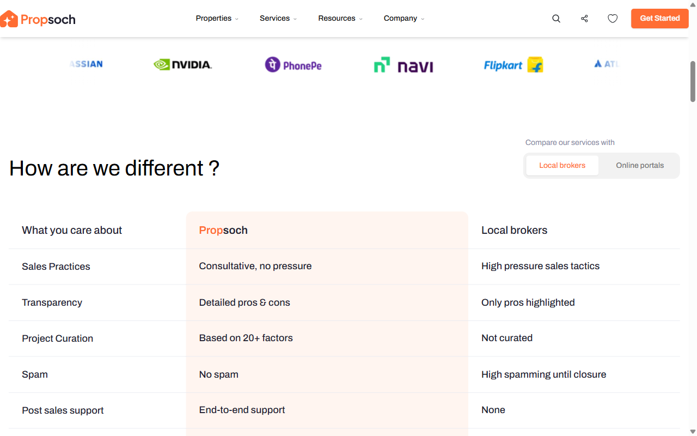

*Caption: Current comparison section on desktop - multiple comparison rows compete for attention.*

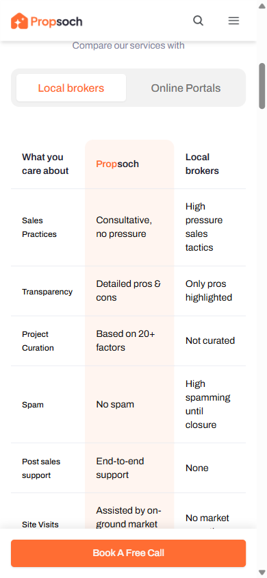

*Caption: Current comparison section on mobile - dense comparison content requires extended vertical scanning.*

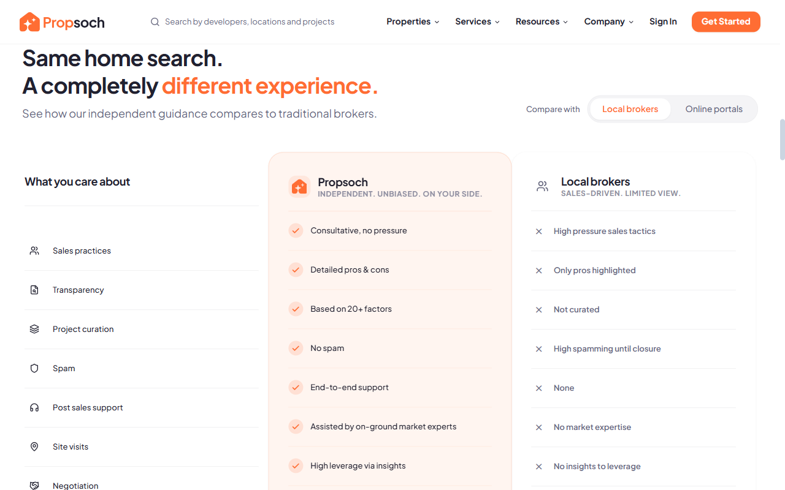

*Caption: Redesigned comparison - stronger hierarchy and grouped information make the difference easier to scan.*

---

## Issue 3 - Customer Stories: Video Dominates the Viewport

### Problem

The original Customer Stories section is heavily video-led. The video presentation can occupy most of the available viewport while the customer's context - such as who they are, where they are from, and their experience - is not always visible at the same time.

The original presentation also starts the video experience without requiring an explicit user action.

On mobile, the smaller viewport can push speaker information further below the fold.

### Impact

The user may encounter the media before understanding:

- Who the customer is
- What their story is about
- Why the story is relevant

Auto-playing media can also compete with the user's attention before they have intentionally chosen to watch it.

### Solution

The redesign uses a **poster-first video experience**:

- The story is represented by a static poster initially.
- Video playback begins only after user interaction.
- The selected story displays the customer's name, location, role and quote alongside the media.
- Desktop uses a structured story layout with a story selector.
- Mobile presents the story content in a vertical sequence followed by the story selector.

This keeps the context and the media connected instead of making the user discover the context after interacting with the video.

### Images

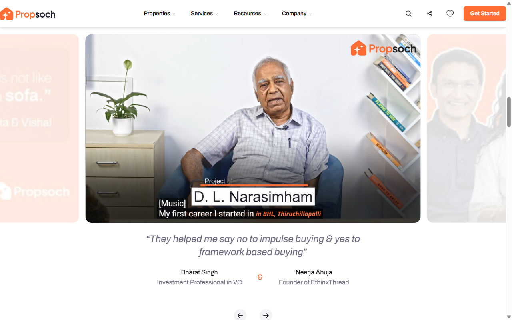

*Caption: Current Customer Stories section on desktop - video-led presentation dominates the available viewport.*

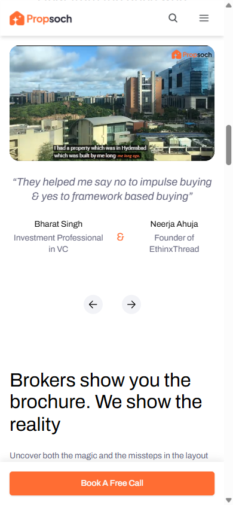

*Caption: Current Customer Stories section on mobile - limited viewport height makes the speaker context easier to push below the fold.*


*Caption: Redesigned Customer Stories - poster-first media with customer context and story navigation kept together.*

---

## Issue 4 - 25-Day Journey: Long, Dense Timeline

### Problem

The original **25-day home-buying journey** contains several stages:

- Today
- Week 1 - Discovery / Longlist
- Week 2 - Site Visits
- Week 3 - Deep Dive
- Last Week - Negotiation / Closure

The content is useful, but the timeline creates a long vertical sequence of information.

A specific desktop interaction issue is that the **right-hand timeline section needed to be independently scrolled** to reveal more weeks while the left section remained visible separately.

On mobile, the same sequence becomes an even longer vertical scroll because the two-column desktop structure collapses into a single-column flow.

### Impact

The user has to spend more effort navigating the timeline rather than understanding the overall journey.

On desktop, independently scrolling the right section adds interaction complexity because the user must discover that more timeline content exists inside that area.

On mobile, the same amount of information increases page length and pushes later stages further down the page.

### Solution

The redesign keeps the journey structure but changes the interaction model.

The **left section remains fixed**, keeping the main heading, CTA and testimonial visible as the user progresses through the journey.

The **right section becomes the scrollable timeline**. As the user scrolls, the right-side journey content progresses through the remaining weeks and reveals all the week cards.

This creates a focused interaction:

> **Fixed context on the left → progressive journey on the right**

The five stages are also made visually clearer:

1. **Start**
2. **Week 1 - Discovery & shortlisting**
3. **Week 2 - Site visits**
4. **Week 3 - Deep dive**
5. **Last week - Negotiation & closure**

This preserves the original 25-day proposition while reducing the need to navigate two separate areas.

### Images

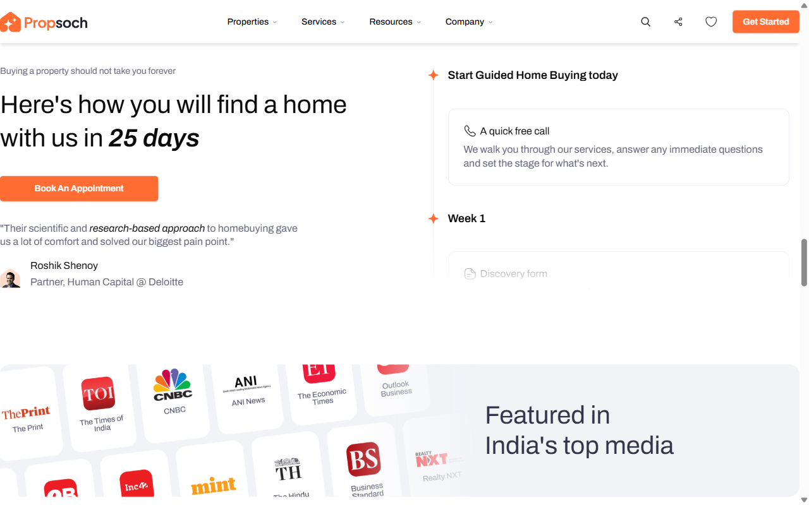

*Caption: Current 25-day journey - the right-side timeline requires additional scrolling to reveal later weeks.*


*Caption: Redesigned 25-day journey - the left context remains fixed while the right timeline scrolls through all journey stages.*


*Caption: Redesigned 25-day journey on mobile - the journey is converted into a responsive sequence while preserving the stage hierarchy.*

---

## Issue 5 - Inconsistent Visual Hierarchy and Typography

### Problem

Across the original homepage, headings, eyebrow text, descriptions, card content and supporting text do not always follow a consistent typographic hierarchy.

Different sections can therefore feel like separate visual systems rather than parts of one product experience.

On mobile, typography becomes even more important because limited width causes headings and supporting content to wrap.

### Impact

Inconsistent typography makes it harder to identify:

- Section hierarchy
- Primary versus secondary information
- Important actions
- Supporting content

This increases cognitive load and reduces the feeling of a cohesive product experience.

### Solution

The redesign establishes a consistent typographic system:

- Consistent eyebrow treatment
- Consistent section heading scale
- Controlled heading line-height
- Consistent body text sizing
- Clear card heading / subheading / body hierarchy
- Responsive typography
- Consistent emphasis for important phrases and metrics

### Images

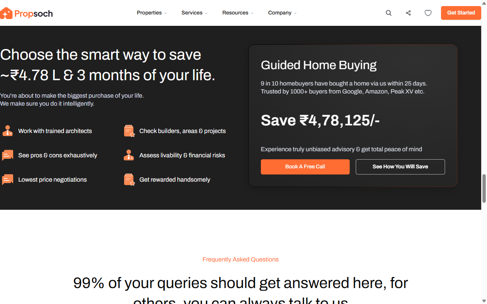

*Caption: Current homepage typography - heading and supporting-text hierarchy varies between sections.*


*Caption: Redesigned typography - consistent type hierarchy creates a more unified visual system.*

---

## Issue 6 - Inconsistent Spacing and Section Rhythm

### Problem

The original homepage uses different amounts of padding, gaps and whitespace between sections and content groups.

On mobile, inconsistent spacing becomes more visible because every additional gap contributes directly to page length.

### Impact

Inconsistent spacing affects the perceived rhythm of the page.

Users should be able to visually distinguish:

**Section → heading → supporting text → content → CTA → next section**

When spacing changes unpredictably, sections can feel disconnected and the page becomes harder to scan.

### Solution

The redesign introduces a systematic spacing approach:

- Consistent section padding
- Consistent spacing between eyebrow, heading and description
- Standardized card gaps
- Consistent CTA spacing
- Controlled mobile spacing
- Clear separation between major sections

This creates a predictable vertical rhythm across the page.

### Images

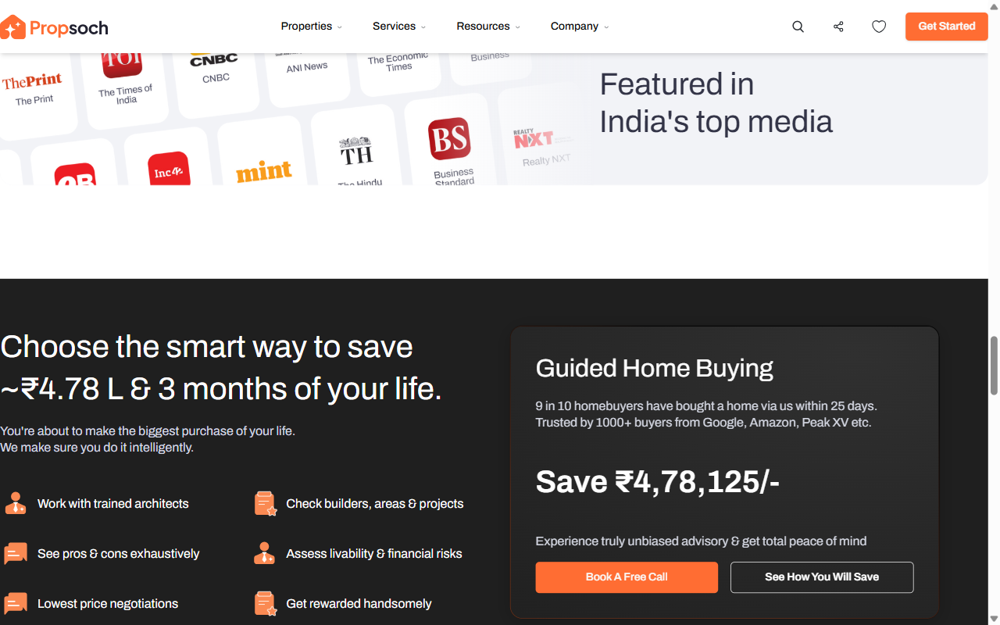

*Caption: Current homepage spacing - section density and vertical gaps vary across the page.*

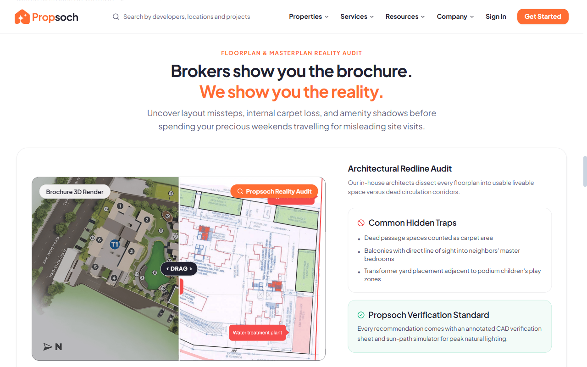

*Caption: Redesigned spacing - standardized section padding and content gaps create a consistent page rhythm.*

---

# Part 2 - Build

## Assignment Scope

The assignment required:

- A redesigned Hero section
- 2 additional sections from the original homepage
- Responsive desktop and mobile design
- Optimized images
- Next.js
- TypeScript
- Tailwind CSS

### Implemented scope

I redesigned the **Hero** and multiple existing sections from the original homepage rather than limiting the work to only the minimum required sections.

The two sections specifically selected as the additional sections were:

1. **Services**
2. **25-Day Guided Home Buying**

I also extended the redesign to other existing sections to maintain a consistent visual system across the full landing page.

### Main redesigned sections

| Section | Treatment |
|---|---|
| **Hero** | Redesigned value proposition, CTA and trust hierarchy |
| **Services** | Redesigned service cards and responsive layout |
| **Property Intelligence / Reality** | Reorganized comparison and visual storytelling |
| **Customer Stories** | Poster-first video, customer context and responsive story navigation |
| **25-Day Guided Home Buying** | Fixed context + scrollable journey |
| **Savings** | Redesigned content hierarchy |
| **FAQ** | Improved information hierarchy and responsive interaction |
| **Final CTA** | Consistent closing conversion section |

---

# 1. Redesigned Hero

### Original approach

The original hero led with a fragmented problem statement around broker sales pitches and incomplete information.

### Redesigned approach

The redesign leads with:

> **“Make a smarter home-buying decision.”**

The supporting content establishes Propsoch as an independent home-buying advisory service and gives the user a clear next action.

Key changes:

- Direct value proposition
- Clear primary CTA
- City selection
- Trust indicators
- Stronger heading hierarchy
- Responsive desktop/mobile layout
- Reduced cognitive load

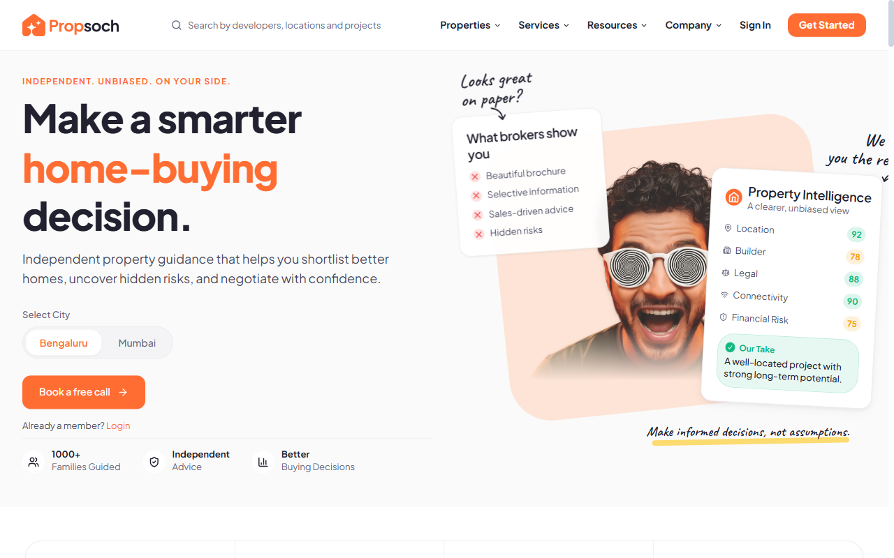

*Caption: Redesigned Hero section on desktop.*

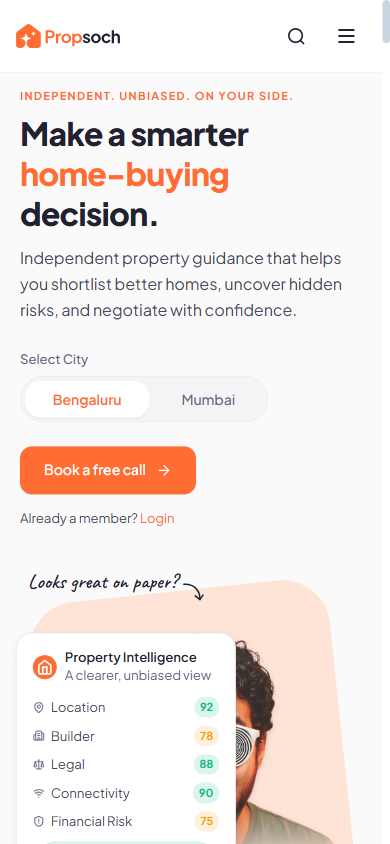

*Caption: Redesigned Hero section on mobile.*

---

# 2. Services Section

The Services section organizes the existing Propsoch offerings into a more structured and scannable presentation.

The redesign focuses on:

- Clear service categories
- Consistent card hierarchy
- Stronger spacing
- Responsive card layout
- Consistent typography
- Clear interaction affordances

### Responsive behavior

On desktop, services use a structured grid.

On mobile, the layout adapts to a single-column/stacked presentation so each service remains readable without forcing horizontal scrolling.

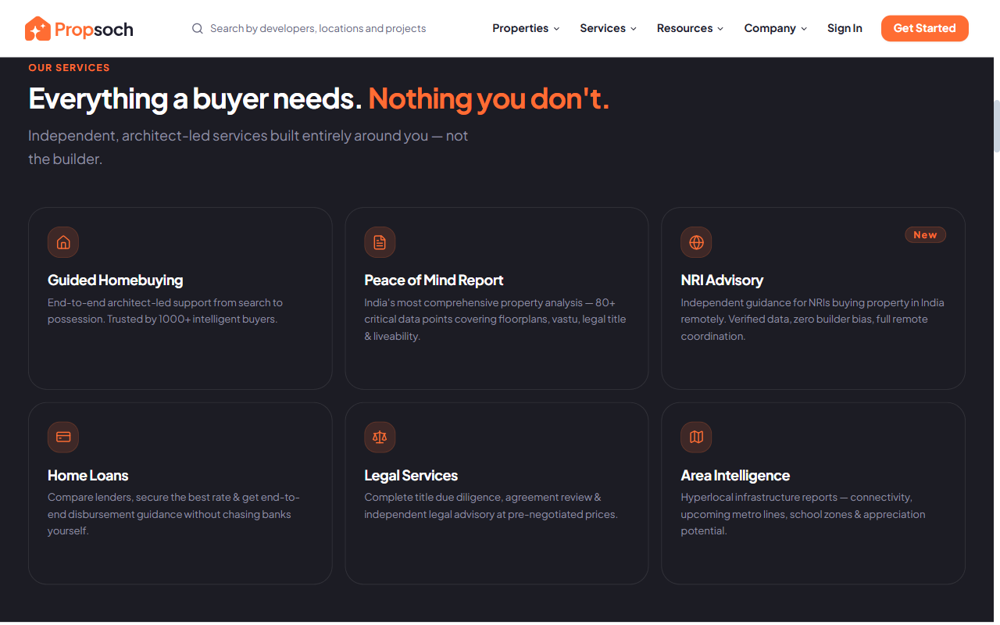

*Caption: Redesigned Services section on desktop.*

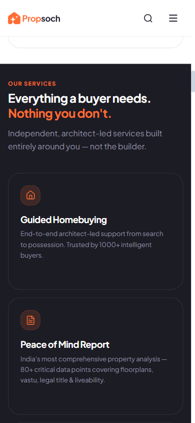

*Caption: Redesigned Services section on mobile.*

---

# 3. 25-Day Guided Home Buying

The original 25-day journey was redesigned as an interaction rather than simply restyling the existing timeline.

### Desktop

The left information panel remains fixed while the right-side journey progresses through the stages.

This allows the user to keep the main context visible while exploring the full process.

### Mobile

The desktop interaction is converted into a responsive sequence so the journey remains readable and usable on a narrow viewport.

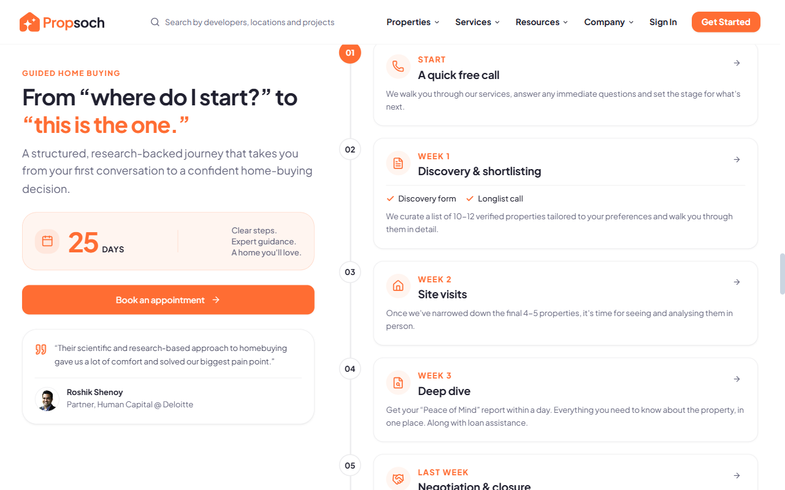

*Caption: Redesigned 25-day journey on desktop - fixed context with a progressive scrollable timeline.*

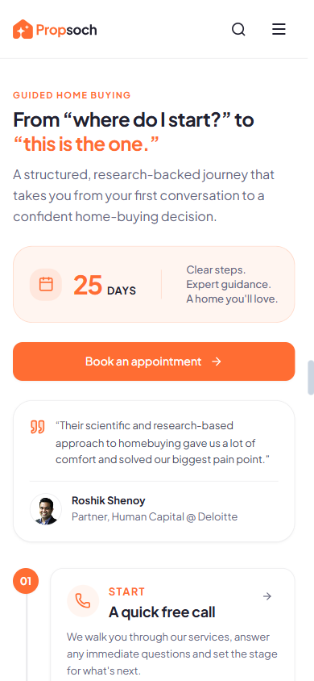

*Caption: Redesigned 25-day journey on mobile - responsive sequential presentation of all stages.*

---

# 4. Customer Stories

The Customer Stories section was redesigned around context-first interaction.

### Original

- Video-led presentation
- Customer context could be separated from the media
- Auto-play behavior

### Redesign

- Static poster shown initially
- User initiates playback
- Customer name, location, role and quote remain visible
- Story selector makes other stories discoverable
- Desktop and mobile layouts are structured independently

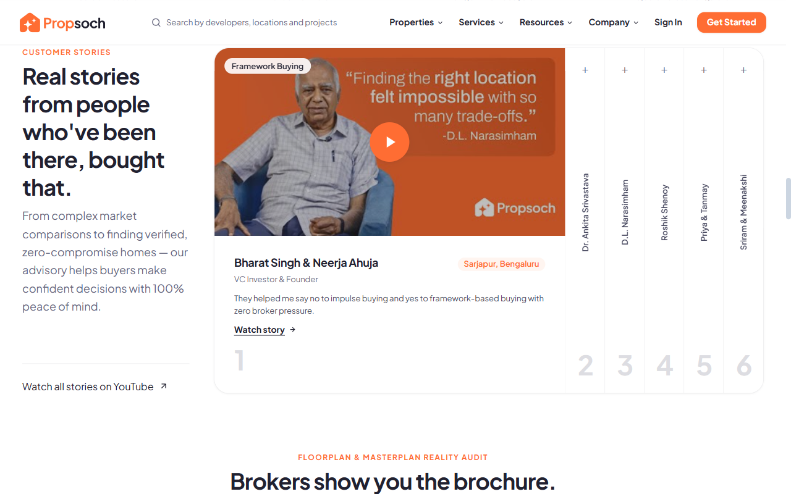

*Caption: Redesigned Customer Stories on desktop - customer context and media are presented together.*

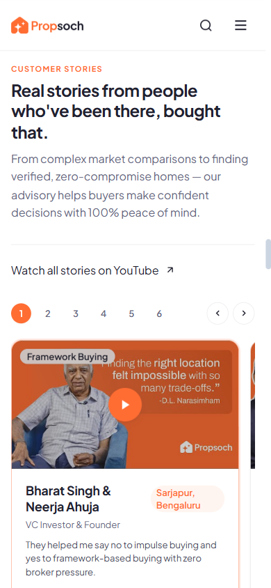

*Caption: Customer Stories responsive presentation on mobile.*

---

# 7. Responsive Design

The page was designed for both desktop and mobile rather than treating mobile as a smaller desktop layout.

### Desktop considerations

- Multi-column layouts where appropriate
- Fixed contextual panels
- Larger visual hierarchy
- Structured card grids
- Wider media presentation

### Mobile considerations

- Single-column content flow
- Responsive typography
- Reduced horizontal density
- Touch-friendly interactions
- Stacked cards
- Responsive story navigation
- Mobile-specific timeline behavior


*Caption: Redesigned landing page - desktop responsive layout.*


*Caption: Redesigned landing page - mobile responsive layout.*

---

# 8. Image and Media Optimization

The redesign uses performance-conscious media handling:

- Responsive image sizing
- Next.js image optimization where applicable
- Explicit image dimensions
- Reduced unnecessary media loading
- Poster-first video presentation
- User-initiated video playback
- Avoiding unnecessary media work before interaction

The goal was to preserve the visual quality of the landing page without treating every media asset as immediately required.

---

# Part 3 - Final Lighthouse Comparison

After implementing the redesign, Lighthouse was run again against the deployed redesign.

**Redesign URL:**  
https://propsoch-landing-page-redesign.vercel.app/

## Lighthouse Results

| Category | Original Mobile | Redesign Mobile | Change | Original Desktop | Redesign Desktop | Change |
|---|---:|---:|---:|---:|---:|---:|
| **Performance** | 41 | **68** | **+27** | 91 | **97** | **+6** |
| **Accessibility** | 84 | **95** | **+11** | 80 | **95** | **+15** |
| **Best Practices** | 100 | **96** | -4 | 100 | **96** | -4 |
| **SEO** | 92 | **100** | **+8** | 83 | **100** | **+17** |

### Mobile - Redesigned Page

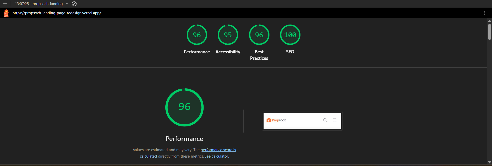

*Caption: Lighthouse audit of the redesigned Propsoch homepage on mobile - Performance 68, Accessibility 95, Best Practices 96 and SEO 100.*

### Desktop - Redesigned Page

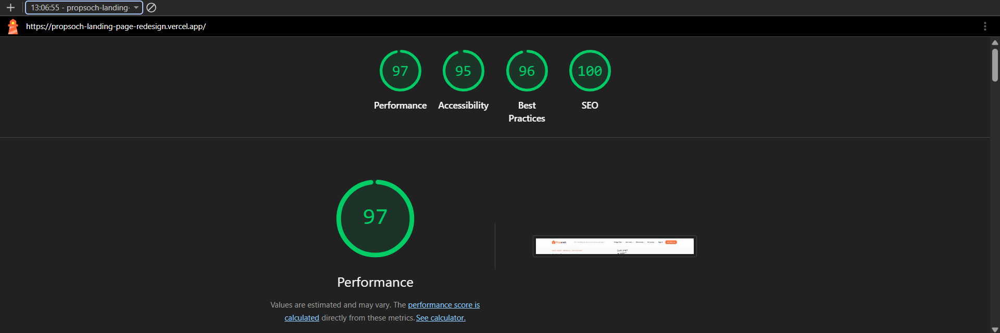

*Caption: Lighthouse audit of the redesigned Propsoch homepage on desktop - Performance 97, Accessibility 95, Best Practices 96 and SEO 100.*

### Results

The redesign improved:

- **Mobile Performance:** 41 → **68**
- **Desktop Performance:** 91 → **97**
- **Mobile Accessibility:** 84 → **95**
- **Desktop Accessibility:** 80 → **95**
- **Mobile SEO:** 92 → **100**
- **Desktop SEO:** 83 → **100**

Best Practices changed from **100 → 96** on both mobile and desktop and is reported here for completeness.

The largest performance gain was on mobile, where the score increased by **27 points**.

---

# Design Decisions Summary

| Original Experience | Redesign Approach |
|---|---|
| Problem-heavy hero | Direct value proposition |
| Dense comparison | Stronger visual grouping |
| Video-first customer stories | Poster-first, user-initiated video |
| Long 25-day timeline | Fixed context + scrollable journey |
| Inconsistent typography | Unified type hierarchy |
| Inconsistent spacing | Systematic spacing scale |
| Media-heavy experience | Performance-conscious media handling |

The overall approach was to preserve the important information from the original Propsoch homepage while improving:

**Hierarchy → Scanability → Responsive behavior → Interaction clarity → Accessibility → Performance**

---

# Project Structure

```text
propsoch-landing-page-redesign/
├── public/
│   ├── audit/
│   └── analysis/
├── src/
│   ├── app/
│   └── components/
├── README.md
├── package.json
├── tsconfig.json
└── ...
```

---

# Running Locally

```bash
npm install
npm run dev
```

Open:

```text
http://localhost:3000
```

For a production build:

```bash
npm run build
npm run start
```

---

# Submission

### Live Site

https://propsoch-landing-page-redesign.vercel.app/

### GitHub Repository

https://github.com/vedant48/propsoch-landing-page-redesign

### Technology

**Next.js · TypeScript · Tailwind CSS**

---

# Conclusion

The redesign does not attempt to replace the information architecture of Propsoch's existing homepage. Instead, it reorganizes the existing content around a clearer user journey:

**Understand the value → See the difference → Build trust → Understand the process → Take action**

The main design goal was to reduce cognitive load while maintaining the depth of information expected from a home-buying advisory product.

The implementation goes beyond the minimum two additional sections by extending the redesign across the broader landing page, while keeping the required Hero, Services and 25-Day Guided Home Buying sections clearly identifiable for evaluation.

# AI-Assisted Development

AI tools were used selectively for UX/UI analysis, design exploration,
implementation assistance, debugging, Lighthouse analysis and documentation.

Relevant prompts and selected project-related conversation history are
provided below.

- [AI Prompts and Chat-history](./ai.md)